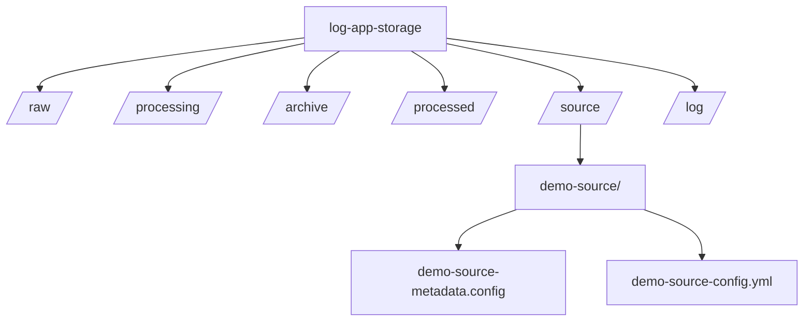

SPEC-001: Activity Log App with Local-Orchestrated ETL Pipeline

**TODO**: Share the Problem Solving Framework Online for the people who need help moving past the tutorial and code examples

1. Background
   This project implements a personal activity logging system that supports a structured ETL (Extract, Transform, Load) pipeline tailored for mobile-first data entry and local-first data processing.
   The system captures raw activity log data through a Progressive Web App (PWA) running on iOS. Due to platform restrictions, the PWA operates with offline-first capabilities, storing raw log entries as structured files in a local directory organized into: /raw/, /processing/, /archive/, and /processed/.
   The ETL process begins by extracting files from the /raw/ directory. These files—originating from various sources—are archived, normalized into a consistent schema (CSV or JSON), validated, and loaded into a SQLite staging database. Each data source maps to its own set of prefixed OLTP tables. Transformed records are merged into a staged schema, which can then be exported to a cloud-based store for downstream analytics.

2. Requirements
   Must Have:

-   PWA-based front-end for offline logging on iOS.
-   Local file directory structured for ETL stages.
-   Incremental ETL process:
    -   Detect new files.
    -   Archive and stage inputs.
    -   Standardize to CSV/JSON.
    -   Validate and transform.
    -   Load into SQLite source-prefixed tables.
    -   Merge into staged schema.
    -   File lifecycle state managed via folder moves.
-   Naming standard: [source]\_[EntityName].
-   SQLite staging database with normalized OLTP schema.
-   Local encryption at rest (SQLite or OS-level).
-   TLS/HTTPS for all remote transmission.
-   Manual/scheduled ETL runners.
-   Centralized ETL logging and error handling.
    Should Have:
-   Cloud backup (S3, Cloudflare R2, Azure Blob).
-   Configurable field mapping and transformations.
-   Modular design for plugin data sources.
-   Application-layer encryption for local DB.
    Could Have:
-   Visual sync feedback in PWA.
-   Support for YAML, TSV, and additional formats.
    Won't Have:
-   Real-time sync or push updates.
-   Data visualization or dashboarding.
-   Native iOS/Android app.

3. Method
   Architecture

```mermaid
flowchart TD
subgraph PWA
A1[Activity Logger UI]
A2[Local File Writer]
A1 --> A2
end
subgraph "Local Storage"
B1[Raw File Directory]
B2[Processing Directory]
B3[Processed Directory]
B4[Archive Directory]
A2 --> B1
end
subgraph ETL_Orchestrator
C1[File Preprocessor]
C2[File Validator]
C3[Format Standardizer (CSV/JSON)]
C4[ETL Runner / Scheduler]
C5[Error Logger]
C6[Archive Manager]
B1 --> C1
C1 --> B4
C1 --> C3
C3 --> C2
C2 --> C5
C2 --> D1
C4 --> C2
C4 --> C6
end
subgraph "SQLite Staging DB"
D1[Source-Specific Tables]
D2[Staged Schema DB]
D1 --> D2
end
subgraph Optional_Export
E1[Cloud DB Export]
D2 --> E1
end
```

Naming Conventions

File/Directory Naming Conventions

A. File Name Conventions

**TODO**: Add other file name conventions for other files, like spec, sql, markdown, archives
**TODO**: Create the configuration files and the validation scripts to enforce the 

-   Format: [SourceName]_[YYYYMMDD]_[HHMMSS].[ext]
-   Prefix with the data source (e.g., pwa, api, excel)
-   Use PascalCase for the entity portion (e.g., ActivityLog, MoodRating)
-   Dimension/Lookup tables follow the same format
    Example: pwa_20250601_073000.json
B. File Type Conventions: .json, .csv

C. Directory Conventions:
-   /raw/ - New files
-   /processing/ - In-progress
-   /archive/ - Backups
-   /processed/ - Loaded successfully
    
Table Naming Conventions
    Format: [Source]\_[EntityName]
    
Examples:
-   pwa_ActivityLog
-   api_SessionRecord
    Staged:
-   staged_ActivityLog
    
Column Naming Conventions
    Text Columns
-   NM: Name (e.g., PersonNM, ActivityNM)
-   DSC: Description (e.g., ActivityDSC)
-   TXT: General text (e.g., NotesTXT)
    
Numeric Columns
-   ID: Primary Key
-   FK: Foreign Key
-   CNT: Count
-   NUM: Ordered/Ranked
-   CD: Enum/Code
-   FL: Boolean Flag
    
Temporal Columns
-   TS: Timestamps
-   DT: Dates
-   DUR: Durations
    Meta Columns
-   VER: Version
-   ST: Status
-   CreatedBy, CreatedOn: Audit fields
    
Staging Schema

```sqlite
-- Grouping of activities (e.g., Health, Entertainment)
CREATE TABLE pwa_ActivityGroup (
ActivityGroupID INTEGER PRIMARY KEY,
GroupNM TEXT NOT NULL UNIQUE,
GroupDSC TEXT
);
CREATE TABLE pwa_Activity (
ActivityID INTEGER PRIMARY KEY,
ActivityNM TEXT NOT NULL,
ActivityDSC TEXT,
ActivityGroupFK INTEGER NOT NULL,
CreatedTS TEXT DEFAULT CURRENT_TIMESTAMP,
FOREIGN KEY (ActivityGroupFK) REFERENCES
pwa_ActivityGroup (ActivityGroupID)
);
CREATE INDEX idx_pwa_ActivityGroup_GroupNM ON
pwa_ActivityGroup (GroupNM);
CREATE INDEX idx_pwa_Activity_ActivityGroupFK ON
pwa_Activity(ActivityGroupFK);
-- Reference Tables (formerly "dim_")
CREATE TABLE pwa_EnergyEffortLevel (
EnergyEffortCD INTEGER PRIMARY KEY,
LevelNM TEXT NOT NULL,
DescriptionDSC TEXT NOT NULL,
SentimentNUM REAL,
VisualTagNM TEXT
);
CREATE TABLE pwa_ProductivityLevel (
ProductivityCD INTEGER PRIMARY KEY,
LevelNM TEXT NOT NULL,
DescriptionDSC TEXT NOT NULL,
SentimentNUM REAL,
VisualTagNM TEXT
);
CREATE TABLE pwa_SocialEngagementLevel (
SocialEngagementCD INTEGER PRIMARY KEY,
LevelNM TEXT NOT NULL,
DescriptionDSC TEXT NOT NULL,
SentimentNUM REAL,
VisualTagNM TEXT
);

-- Main log table

CREATE TABLE pwa_ActivityLog (
ActivityLogID INTEGER PRIMARY KEY,
ActivityFK INTEGER NOT NULL,
LogTS TEXT NOT NULL,
EnergyEffortFK INTEGER NOT NULL,
ProductivityFK INTEGER NOT NULL,
SocialEngagementFK INTEGER NOT NULL,
MoodNUM INTEGER NOT NULL,
NotesTXT TEXT,
CreatedTS TEXT DEFAULT CURRENT_TIMESTAMP,
FOREIGN KEY (ActivityFK) REFERENCES pwa_Activity (ActivityID),
FOREIGN KEY (EnergyEffortFK) REFERENCES
pwa_EnergyEffortLevel (EnergyEffortCD),
FOREIGN KEY (ProductivityFK) REFERENCES
pwa_ProductivityLevel (ProductivityCD),
FOREIGN KEY (SocialEngagementFK) REFERENCES
pwa_SocialEngagementLevel (SocialEngagementCD)
);

CREATE INDEX idx_pwa_LogTS ON pwa_ActivityLog(LogTS);
CREATE INDEX idx_pwa_ActivityFK ON
pwa_ActivityLog (ActivityFK);
CREATE INDEX idx_pwa_MoodNUM ON
pwa_ActivityLog (MoodNUM);
```

Indexing the Staging Schema

```sqlite
CREATE INDEX idx_staged_LogTS ON staged_ActivityLog(LogTS);
CREATE INDEX idx_staged_MoodNUM ON
staged_ActivityLog (MoodNUM);
```

Indexing the Staged Schema

```sqlite
CREATE INDEX idx_fact_LogTS ON fact_ActivityMoodLog(LogTS);
CREATE INDEX idx_fact_MoodNUM ON
fact_ActivityMoodLog (MoodNUM);
CREATE INDEX idx_fact_ActivityFK ON
fact_ActivityMoodLog (ActivityFK);
```

3. Implementation

   This section outlines the step-by-step phases needed to construct the local-first, ETL-driven activity logging application.
1. PWA Logging App (Client-Side)
   Develop a mobile-first PWA using a framework such as SvelteKit, React, or Vue.
   UI for:

-   Logging activities, mood, ratings, and notes
-   Selecting predefined activities and activity groups
    Store logs locally using IndexedDB or localStorage.
    Save log entries as structured JSON files into /raw/ folder via:
-   Capacitor file system plugin
-   WKWebView bridge (iOS)
-   Browser-based download fallback

2. Local File System Structure
   Set up the following directory layout in the user's sync-able storage space (e.g., iCloud Drive or local folder):

3. Creating an Orchestrator 



A. Data Orchestration
 
 Process:

-   Begins by extracting files from the /raw/ directory
-   Files are archived
-   Files are validated
-   Normalized (CSV or JSON)
-   Loaded into a SQLite staging database.
    Remember:
-   Each data source writes to its own logically isolated table using source-prefixed names.
-   Each source has a configuration file that makes the system modular and able to support logging multiple sources of data.
-   Follows the defined Formatting Specifications for file names, table names, column names, and log file formats.
    Once transformed, the data is consolidated into a staged schema for analytics. Processed files are moved to /processed/ to prevent reprocessing. The final output is prepared for optional export to cloud storage or a hosted database.
    
CLI Structure:
    etl with Subcommands
    We'll design a CLI with the following core subcommands:
    Core Commands
-   etl extract --source pwa --dry-run
-   etl transform --source pwa
-   etl load --source pwa
-   etl merge --target staged
-   etl export --format sqlite --destination ./exports/
    CLI Command Breakdown

1. etl extract
   Extract raw files from the /raw/[source]/ folder, optionally move to /processing/.

-   --source <source>: Name defined in sources.yaml
-   --dry-run: Show files matched but do not move them
-   --move: Moves files to /processing/

2. etl transform
   Apply validation, schema mapping, and normalization to extracted files.

-   Reads source config to map fields
-   Applies type conversions, standardizes timestamps, etc.
-   Writes clean rows to in-memory structure or temp file

3. etl load
   Inserts validated rows into the SQLite pwa\_ (or source-specific) tables.

-   --source <source>
-   Performs FK checks
-   Logs any rows that fail constraints

4. etl merge
   Joins source-specific tables into the staged_ActivityLog flat table or view.

-   --target staged: optional target table/view name
-   Can be scheduled daily or after load

5. etl export
   Package and export the result of staged or fact_tables.

-   --format sqlite|csv|json
-   --destination ./path/to/folder
-   Compresses and optionally signs
    Recommended CLI Project Structure

```
etl/
├── cli.py
├── config/
│   └── sources.yaml
└── modules/
├── extract.py
├── transform.py
├── load.py
├── merge.py
└── export.py
└── storage/
└── app.db
└── logs/
```
-----------------
-----------------

Going with the CLI for development but gonna move to utilizing a different approach after I get things up. i was thinking of using an orchestrator and having an observer that will put telemetry for the runs because this will ideally be automated. 

Split up the 


etl/
├── cli.py
├── config/
│   └── sources.yaml
└── modules/
└── 
└── extract.py 
├── transform.py
├── load.py
├── merge.py
└── export.py
└── storage/
└── app.db
└── logs/


Footnotes Section

Footnotes

[^directory-chart]: This is a diagram of the Directory in markdown format

**TODO** - Fix formatting and remove the markdown 

**TODO** - Fix add more footnotes with links to the markdown

**TODO** - After I get the orm done make updates to the schema

**TODO** - Add SemVersion columns to all the rows of the db
